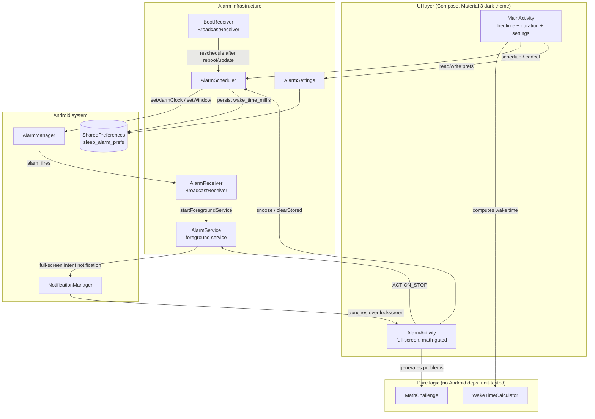

# Architecture

Sleep Alarm is a single-module app (`:app`, package `com.sleepalarm`) with no backend, no database, and no third-party dependencies. One constraint shapes almost everything: the alarm has to ring reliably at a moment when the app process is probably dead and the device is probably in Doze. The Compose UI, the settings, the math gate — all of that hangs off that spine.

## Component overview

## The two halves

### Setup path — user is awake, app is in the foreground

`MainActivity` renders one Compose screen (`SleepAlarmScreen`). The user picks a bedtime ("Right now", or a specific `LocalTime` via a Material 3 `TimePicker` dialog), a duration (a `Slider` from 1 to 12 hours in half-hour steps), and settings — snooze length (5/10/15 min) and math difficulty (Easy/Medium/Hard) via `FilterChip` rows, persisted immediately through `AlarmSettings`.

The wake time comes from `WakeTimeCalculator`, a pure Kotlin object with no Android imports, and is previewed live. A `LaunchedEffect` ticks `now` every second, which matters in "Right now" mode where the wake time drifts along with the clock. Pressing **Set alarm** calls `AlarmScheduler.schedule(wakeMillis)`.

### Ring path — user is asleep, the app process may not exist

This is a relay where each stage has to assume the previous one might get killed:

1. `AlarmManager.setAlarmClock` is the one alarm API that's exempt from Doze and battery optimization by design (and it puts an alarm indicator in the status bar). It fires a broadcast `PendingIntent`.
2. `AlarmReceiver` grabs a 10-second partial wakelock *before* calling `startForegroundService`. That ordering matters: a service start is only enqueued in `onReceive`, and on aggressive OEM power management the CPU could go back to sleep before the service ever runs. Then it hands off.
3. `AlarmService` — a foreground service (type `systemExempted` on Android 14+, `mediaPlayback` on 10–13) — acquires its own partial wakelock (1-hour safety cap), starts vibration first, then loops the system alarm sound via `MediaPlayer` on `USAGE_ALARM` with a 60-second volume ramp, posts a high-importance DND-bypassing notification carrying a full-screen intent for `AlarmActivity`, and arms a 10-minute auto-snooze timer.
4. `AlarmActivity` gets launched by the system from the full-screen intent, over the lockscreen, screen forced on. It blocks the back button and gates Snooze/Dismiss behind `MathChallenge` problems. On success it stops the service (`ACTION_STOP`) and either re-schedules (snooze) or clears the stored alarm (dismiss).

## Data flow and storage

All persistence is one `SharedPreferences` file, `sleep_alarm_prefs` (the name is defined once, in `AlarmSettings.PREFS_NAME`, and shared with `AlarmScheduler`):

| Key | Type | Written by | Read by | Meaning |
|---|---|---|---|---|
| `wake_time_millis` | `Long` | `AlarmScheduler.schedule` / `scheduleWithFallback`; removed by `cancel` / `clearStored` | `MainActivity.onResume` (active-alarm card), `BootReceiver` | Epoch millis of the pending alarm; absent or ≤0 means no alarm |
| `snooze_minutes` | `Int` | `AlarmSettings.snoozeMinutes` setter (from the chips in MainActivity) | `AlarmScheduler.snooze`, `AlarmActivity` | Snooze length, default 5 |
| `math_difficulty` | `String` (enum name) | `AlarmSettings.difficulty` setter | `AlarmActivity` | `EASY` / `MEDIUM` / `HARD`; default `MEDIUM`, unknown values fall back to `MEDIUM` |

Why SharedPreferences and not a database: there's exactly one alarm, three scalar settings, and nothing to query. The stored wake time also serves as the source of truth for reboot recovery — `BootReceiver` re-arms `AlarmManager` from it, since AlarmManager registrations don't survive reboots or app updates.

## External integrations

None. The app talks only to Android system services: `AlarmManager`, `NotificationManager`, `PowerManager` (wakelocks), `Vibrator`/`VibratorManager`, `KeyguardManager`, `RingtoneManager`/`MediaPlayer`, and the Settings app (deep links for the three runtime permissions it may need help with).

## Threading and process model

Everything runs on the main thread. No coroutine dispatchers beyond Compose's own, no worker threads, no `HandlerThread`s. That's a choice, not an oversight: the work is all UI, tiny arithmetic, or delegation to system services that do their own heavy lifting.

`AlarmService` uses a `Handler(Looper.getMainLooper())` for its two timers — the 10-minute auto-snooze and the 20-step volume ramp. `stopRinging()` clears both with `removeCallbacksAndMessages(null)`. On the Compose side, `LaunchedEffect` tickers in both screens (one-second `delay` loops) keep the displayed clock and the wake-time preview current.

The app process is expected to be dead when the alarm fires. Each stage of the relay (AlarmManager → receiver → foreground service → full-screen activity) can cold-start the process, and wakelocks bridge the gaps: the receiver's 10-second timed lock covers service startup, and the service's 1-hour-capped lock covers ringing.

`AlarmActivity` is declared `launchMode="singleInstance"` with `excludeFromRecents="true"`, so repeated fires don't stack instances and the alarm screen never lingers in recents.

## Why it's structured this way

`WakeTimeCalculator` and `MathChallenge` are pure Kotlin objects so they can be unit-tested on the JVM without Robolectric or an emulator (see `app/src/test/`). They hold the only logic where a silent bug would be catastrophic — waking at the wrong time, or an unanswerable math problem.

`AlarmScheduler` and `AlarmSettings` are thin `Context`-constructed helpers rather than singletons or DI-managed services. Each of the five Android entry points (two activities, two receivers, one service) makes its own instance. Correctness comes from every instance writing to the same prefs file and using the same `PendingIntent` identity (`REQUEST_CODE = 1001` plus the same intent), not from shared object state.

The service owns the sound; the activity is just a control surface. The alarm keeps ringing even if the full-screen activity never appears (say, full-screen-intent permission was revoked on Android 14+) — the user can still reach `AlarmActivity` from the notification. And stopping the sound never depends on the activity: the auto-snooze broadcast closes it, but the service goes quiet on its own.

The dual foreground-service type in the manifest (`systemExempted|mediaPlayback`) is selected at runtime by SDK level in `AlarmService.startAsForeground`: `systemExempted` is what Google prescribes for alarm apps on API 34+, `mediaPlayback` is the correct/available type on 29–33, and pre-29 uses the untyped `startForeground` overload.

No third-party dependencies keeps the APK small and the reliability surface auditable — every failure mode in the ring path is either in this repo or in the OS.
