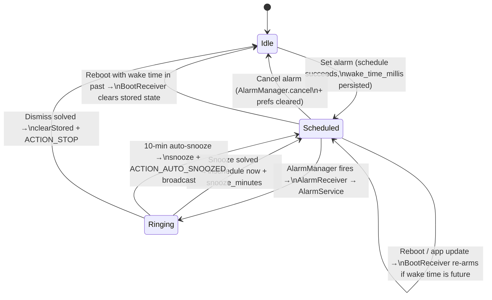

# Design

The design decisions behind Sleep Alarm, plus the data model, the intent contracts between components, the alarm lifecycle, error handling, and security notes. Everything here describes the current source, not aspirations.

## 1. Key decisions

### Duration-first setup

Users give a bedtime and a number of sleep hours; the app computes the wake time (`WakeTimeCalculator`). The premise of the app is optimizing sleep quantity, and this removes mental arithmetic at the worst possible time of day. The computed wake time is previewed live but re-computed at the moment **Set alarm** is pressed — using `System.currentTimeMillis()`, not the possibly-stale preview tick — so "Right now" mode is accurate to the tap.

### Asymmetric math gating

Snooze costs one addition problem (`a + b`). Dismiss costs a mixed problem (`a × b + c`). At any given difficulty level, dismiss is harder than snooze (compare the operand ranges in `MathChallenge`) because fully waking up is the state the user should have to prove. And a wrong answer regenerates the problem (`AlarmScreen.submit()` in `AlarmActivity.kt`), so a groggy user can't iterate guesses against one fixed sum.

### One alarm, ever

The app supports exactly one pending alarm. `AlarmScheduler` uses a single fixed `PendingIntent` request code (`REQUEST_CODE = 1001`) with `FLAG_UPDATE_CURRENT`, so scheduling again just replaces the previous alarm, and one prefs key (`wake_time_millis`) stores it. This kills a whole class of bugs — alarm lists, IDs, cancellation races — at the cost of a feature the app's premise doesn't need.

### Sound in a service, UI in an activity

`AlarmService` rings and vibrates whether or not `AlarmActivity` ever appears; the activity is just a control surface. This keeps the app working when the full-screen-intent permission gets revoked (Android 14+): the alarm still sounds, and the user reaches the math screen by tapping the notification.

### Degrade, never go silent

Every ring-path failure lands on something audible or perceptible rather than silence:

- Vibration starts *before* `MediaPlayer` setup, so a broken ringtone still wakes the user.
- Missing `TYPE_ALARM` ringtone falls back to `TYPE_RINGTONE`, then to vibration-only — with the notification text updated so the user knows why it's quiet (`notifySoundUnavailable`).
- Missing exact-alarm permission at snooze or boot time: `scheduleWithFallback` uses `AlarmManager.setWindow` with a 10-minute window, so the alarm may be late but never dropped. (The *initial* schedule from `MainActivity` refuses instead and sends the user to Settings — at setup time the user is awake and able to fix it.)
- Nobody answers for 10 minutes: `autoSnooze()` snoozes and stops, rather than ringing until the battery dies.

### Pure logic, extracted for tests

`WakeTimeCalculator` and `MathChallenge` have zero Android imports and are covered by JVM unit tests (`WakeTimeCalculatorTest`, `MathChallengeTest`). Time-zone handling is explicit — `ZoneId` is a parameter, and the tests pin it to UTC.

### Visual design (night theme)

The UI implements the "Sleep Alarm Prototype" Claude Design project (Midnight ring variant). Everything lives in `Theme.kt`.

The palette (`NightColors`) is always dark: warm near-black indigo surfaces (`#14141F` app, `#0C0C15` ring screen, `#1B1B28` cards), amber `#EDB45E` for the snooze/primary path, lavender `#A99BDD` for dismiss. An alarm app gets used in the dark, so there is no light theme on purpose. Numerals, display, and headline text use Space Grotesk (bundled in `res/font` — no downloadable-fonts dependency); body text uses the system sans.

Structurally there's a bottom nav with Sleep / History / Settings tabs. The home tab is duration-first, exactly like the prototype: with nothing armed, the tab *is* the picker — "How long do you want to sleep?", a 3h–12h slider in 15-minute steps, the 90-minute-cycle visual, whole-cycle shortcut chips, and one big "Start sleeping — wake at X" action. Once the soonest enabled alarm is pending, home becomes the calm armed state: a slow pulsing amber ring behind the wake time, a sleep summary, and "Cancel alarm". Any further alarms (widget/tile one-shots, repeats) stay editable in cards below. History shows one row per completed wake-up session (day, wake time, snooze detail, CLEAN/×n/AUTO badge) with avg-snoozes / first-try-% / streak stat cards, aggregated by `HistoryStats.sessions`. Settings adds the prototype's fall-asleep-buffer chips (`AlarmSettings.fallAsleepMinutes`, +10/+15/+20/+30 min) and a concrete per-difficulty sample line.

The ring screen has a pulsing amber circle behind the clock, an amber snooze pill against an outline dismiss button (visually echoing the snooze-easy/dismiss-hard asymmetry), a live `auto-snooze in m:ss` countdown (`AlarmService.autoSnoozeAtElapsed`), and an on-screen keypad for math/memory answers with a shake animation on wrong input.

One subtlety on duration semantics: the picker counts sleep only, but the persisted `sleepHours` remains "total time in bed" (sleep + fall-asleep buffer), so the quick-alarm widget, the tile, and the bedtime reminder keep their existing meaning.

## 2. Data model

Two in-memory types and one persisted record.

```kotlin
// MathChallenge.kt
data class MathProblem(val question: String, val answer: Int)

enum class MathChallenge.Difficulty { EASY, MEDIUM, HARD }
```

Problem generation ranges, verbatim from `MathChallenge`:

| Difficulty | Snooze `a + b`, operands from | Dismiss `a × b + c` (a, b, c ranges) |
|---|---|---|
| EASY | `2..19` | `6..15`, `2..5`, `5..30` |
| MEDIUM (default) | `12..89` | `13..29`, `4..9`, `11..99` |
| HARD | `25..199` | `21..60`, `6..13`, `50..300` |

Persisted state is one `SharedPreferences` file, `sleep_alarm_prefs`, holding three groups of keys.

**Settings** — about 20 keys defined in `AlarmSettings.kt`, which is the source of truth for the full list and defaults. Some representative ones:

| Key | Type | Default | Semantics |
|---|---|---|---|
| `snooze_minutes` | Int | `5` (choices 5/10/15 — `AlarmSettings.SNOOZE_CHOICES`) | Snooze duration |
| `math_difficulty` | String | `"MEDIUM"` | Enum name; unrecognized stored values (say, after a rename) fall back to MEDIUM rather than crashing |
| `bedtime_second_of_day` / `sleep_hours` | Int / Float | 23:00 / `8.0` | Weekday bedtime profile; `_weekend` variants exist for the weekend profile, selected via `active_profile` |
| `snooze_count`, `snooze_targets`, `wake_check_pending`, `ringing_alarm_id` | various | absent | Volatile per-session ring/snooze state, reset by the boot/app-open repair paths |

The remaining settings keys cover challenge type, wake-up check, max snoozes, max ring minutes, vibration, volume ramp, alarm sound URI, bedtime reminder, and the battery-prompt flag — see `AlarmSettings.kt` lines 13–37.

**Alarm list** — `alarms` (a string-set of encoded `Alarm` records) and `next_alarm_id`, owned by `AlarmStore`.

**History** — `alarm_history`, owned by `HistoryStore`.

This prefs file is included in cloud backup and device-to-device transfer on purpose (`res/xml/data_extraction_rules.xml` for API 31+, `res/xml/backup_rules.xml` for older devices). The alarm list, settings, and history are user data worth restoring. Cached trigger times and `AlarmManager` registrations are of course stale after a restore, but both `BootReceiver` and `MainActivity.onCreate` run `AlarmScheduler.rescheduleAll()`, which recomputes and re-registers them — include and repair, rather than exclude. The volatile session keys (snooze count, wake-check pending, snooze targets) can restore stale too; SharedPreferences backup is file-granular so they can't be excluded individually, but the same boot/app-open paths reset them, so it's harmless.

There's a known timezone trade-off. One-shot alarms store an absolute epoch-millis trigger (`Alarm.triggerAtMillis` is authoritative when `repeatDays` is empty), so after a timezone change they ring at the original *instant*, not the original wall-clock time. Repeating alarms are authoritative in `hour`/`minute` and get recomputed (e.g. on `ACTION_TIMEZONE_CHANGED` via `SystemEventsReceiver`), so they follow the wall clock. The asymmetry is accepted and documented here.

## 3. Intent / IPC contracts

All IPC is intra-app Android intents. The exported components are `MainActivity` (launcher), `QuickAlarmWidgetProvider` (app-widget providers must be exported so the launcher can deliver `APPWIDGET_UPDATE` broadcasts), and `QuickAlarmTileService` (tile services must be exported for System UI to bind; access is gated by `android.permission.BIND_QUICK_SETTINGS_TILE`). Everything else is `exported="false"`.

**AlarmManager → AlarmReceiver.** A broadcast `PendingIntent`: `Intent(context, AlarmReceiver::class.java)`, request code `1001`, flags `FLAG_UPDATE_CURRENT or FLAG_IMMUTABLE`. Scheduled with `setAlarmClock` (exact) or `setWindow(RTC_WAKEUP, t, 10 min)` (fallback). `setAlarmClock` also carries a show intent (`PendingIntent.getActivity` → `MainActivity`) used by the system UI's alarm indicator.

**AlarmReceiver → AlarmService.** `startForegroundService` with action `AlarmService.ACTION_START` (`"com.sleepalarm.action.START_ALARM"`). Worth knowing: `onStartCommand` treats *any* action other than `ACTION_STOP` as a start.

**AlarmActivity → AlarmService.** `startService` with `AlarmService.ACTION_STOP` (`"com.sleepalarm.action.STOP_ALARM"`) — the service stops ringing and calls `stopSelf()`.

**AlarmService → AlarmActivity.** On auto-snooze the service broadcasts `ACTION_AUTO_SNOOZED` (`"com.sleepalarm.action.ALARM_AUTO_SNOOZED"`) with `setPackage(packageName)` so it stays in-app. `AlarmActivity` listens with a non-exported runtime receiver (`ContextCompat.RECEIVER_NOT_EXPORTED`) and just `finish()`es.

**System → BootReceiver.** Manifest-registered for `BOOT_COMPLETED` and `MY_PACKAGE_REPLACED`; any other action is explicitly ignored.

**Notification contract.** Channel `alarm_channel`, importance HIGH, channel sound and vibration disabled (the service produces both itself), `setBypassDnd(true)`. Notification ID `42`, `CATEGORY_ALARM`, ongoing, with both `setFullScreenIntent(..., true)` and `setContentIntent` pointing at `AlarmActivity` — the content intent is the fallback for when full-screen intents are blocked.

## 4. Alarm lifecycle



Within Ringing, `AlarmActivity`'s UI has a small state machine of its own: `problem == null` shows the Snooze/Dismiss buttons; picking one sets `pendingAction` and generates a problem; a correct answer triggers the action, a wrong one increments `wrongAttempts` and regenerates. The **Back** button on the challenge (not the system back, which is blocked) returns to the button state.

## 5. Error handling

Permission failures are user-recoverable, guided, and never fatal:

- `POST_NOTIFICATIONS` (API 33+) is requested on fresh launch only (`savedInstanceState == null`, so rotation doesn't re-prompt). On denial with rationale unavailable — i.e. permanent denial — the user gets deep-linked to the app's notification settings.
- Exact alarms (API 31–32): `schedule()` returns `false` when `canScheduleExactAlarms()` is false; `MainActivity` toasts and opens `ACTION_REQUEST_SCHEDULE_EXACT_ALARM`. On API 33+ `USE_EXACT_ALARM` is auto-granted for alarm apps, and `SCHEDULE_EXACT_ALARM` is manifest-capped at `maxSdkVersion=32`.
- Full-screen intent (API 34+): after a successful schedule, `warnIfFullScreenIntentBlocked()` checks `canUseFullScreenIntent()`; if blocked, it toasts and opens `ACTION_MANAGE_APP_USE_FULL_SCREEN_INTENT`.

Media failures: `MediaPlayer` setup is wrapped in `try/catch (Exception)`. On failure the player is released, `mediaPlayer` stays `null`, and the notification is re-posted with the vibration-only message. `stopRinging()` guards `stop()` against `IllegalStateException`, and the volume-ramp runnable checks identity (`mediaPlayer !== player`) and catches `IllegalStateException`, so a released player can't crash the handler loop.

Re-entrancy: `AlarmService.startRinging` is guarded by an explicit `ringing` flag — not by `mediaPlayer != null`, because the vibration-only fallback leaves `mediaPlayer` null.

Timers act as safety valves everywhere: the receiver wakelock is capped at 10 seconds, the service wakelock at 1 hour, ringing at 10 minutes (auto-snooze). Nothing can hold a wakelock or ring indefinitely.

Input validation: the answer field filters to digits in the UI and parses with `toIntOrNull()`; malformed input just counts as a wrong answer.

Stale state: `BootReceiver` clears a stored wake time that's already in the past, and `MainActivity` only shows the active-alarm card when `currentAlarm > System.currentTimeMillis()`.

## 6. Security notes

- Small attack surface: `AlarmActivity`, `AlarmReceiver`, `BootReceiver`, and `AlarmService` are all `android:exported="false"`. Exported components are limited to `MainActivity` (required for the launcher), `QuickAlarmWidgetProvider` (framework-required for app widgets), and `QuickAlarmTileService` (framework-required; bindable only by holders of `BIND_QUICK_SETTINGS_TILE`, i.e. System UI).
- Every `PendingIntent` uses `FLAG_IMMUTABLE`, so other apps can't hijack or mutate them.
- Broadcasts are package-scoped: the auto-snooze broadcast uses `setPackage(packageName)` and the receiver is registered `RECEIVER_NOT_EXPORTED`, so no other app can spoof or observe it.
- No network, no data collection. There's no `INTERNET` permission, and storage is local preferences only (settings, alarm list, history). The closest thing to PII is what someone could infer from a locally stored wake time.
- `android:allowBackup="true"` is set, so prefs (wake time included) ride along in device backups. Benign for this data, but worth knowing.
- The requested permissions are the minimum for the feature set: exact alarm, notifications, full-screen intent, wakelock, vibrate, boot, and the two foreground-service-type permissions matching the declared service types.
- Known non-goal: a determined user can always silence the alarm without math via OS-level escape hatches — force-stop from Settings, volume, uninstall. The math gate is friction against half-asleep behavior, not a security boundary against the device owner.
